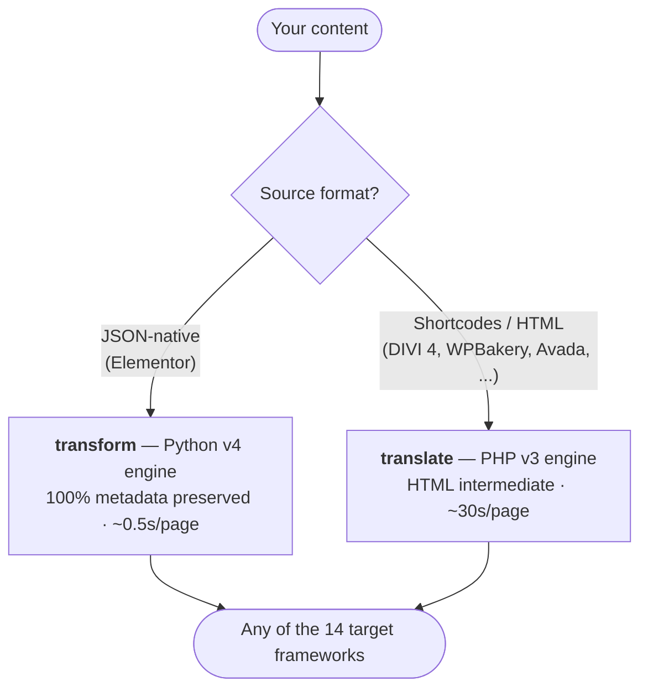
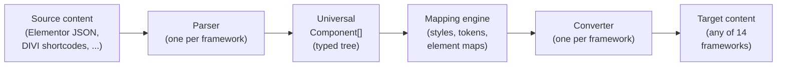

# DevelopmentTranslation Bridge

**Move a WordPress site from one page builder to another — without rebuilding
it by hand.** Translation Bridge converts content between 14 frameworks —
Elementor, DIVI, Gutenberg, Bricks, Oxygen, Avada, WPBakery, Beaver Builder,
Kadence, Thrive, Bootstrap, plus native support for the ground-up rewrites
(DIVI 5, Elementor 4 Atomic Editor, Oxygen 6).

[](https://github.com/coryhubbell/Development-Translation-Bridge/actions/workflows/ci.yml)
[](https://github.com/coryhubbell/Development-Translation-Bridge/releases/tag/v4.3.4)
[](https://github.com/coryhubbell/Development-Translation-Bridge/releases/tag/v4.3.4)
[](#requirements)
[](#requirements)
[](LICENSE)
[](#supported-frameworks)
[](#supported-frameworks)

**[Quick start](#quick-start) · [CLI reference](#cli) · [Python API](#python-api)
· [REST API](#rest-api) · [Architecture](#architecture) · [Latest release notes](https://github.com/coryhubbell/Development-Translation-Bridge/releases/latest)**

---

## What it does

Translation Bridge takes content in any supported page builder's native format
(Elementor JSON, DIVI shortcodes, Gutenberg blocks, etc.) and re-emits it in
another framework's format. It runs as either a WordPress plugin (with a REST
API), a standalone CLI, or a Python library.

Typical situations it solves:

- **Builder migration.** A site built on Elementor needs to become
  Gutenberg-native (or Bricks, or anything else) — convert the pages instead
  of rebuilding them.
- **Version rewrites.** DIVI 4 → DIVI 5, Elementor 3 → Elementor 4 Atomic,
  Oxygen 4 → Oxygen 6: the successor formats are supported natively, so
  legacy content can be modernized in place.
- **Clean HTML output.** Emit framework-free Bootstrap 5 HTML from any
  builder — useful for handoffs, static exports, and AI/agentic content
  pipelines.
- **No silent data loss.** Elements without a native equivalent in the target
  framework are preserved and visibly annotated rather than dropped.

Two transformation paths — pick by your source format:


```mermaid
flowchart TD
    IN(["Your content"]) --> Q{"Source format?"}
    Q -->|"JSON-native<br/>(Elementor)"| T["<b>transform</b> — Python v4 engine<br/>100% metadata preserved · ~0.5s/page"]
    Q -->|"Shortcodes / HTML<br/>(DIVI 4, WPBakery, Avada, ...)"| L["<b>translate</b> — PHP v3 engine<br/>HTML intermediate · ~30s/page"]
    T --> OUT(["Any of the 14 target frameworks"])
    L --> OUT
```

| Path | Engine | Approach | Metadata | Speed | Best for |
|---|---|---|---|---|---|
| `transform` | Python (v4) | JSON-native | **100%** | ~0.5s/page | Elementor JSON today; more JSON source parsers planned |
| `translate` | PHP (v3) | HTML intermediate | ~42% | ~30s/page | Any framework, including shortcode-based (WPBakery, DIVI 4, Avada) |

The `transform` path is the recommended default; `translate` is retained for
HTML-based frameworks that don't have a JSON canonical form and for sources
whose v4 parser is not production-ready yet.

---

## Supported frameworks

14 frameworks → 182 translation pairs (`N × (N-1)`).

| Framework key | CMS version targeted | Format | Notes |
|---|---|---|---|
| `bootstrap` | Bootstrap 5.3.x | HTML | Universal output, AI-friendly |
| `elementor` | Elementor 3.30.0 | JSON | Section → Column → Widget |
| `elementor-4` | Elementor 4.0.0 | JSON | Atomic Editor (`e-div-block`, `e-flexbox`, `e-heading`...) |
| `divi` | DIVI 4.27.0 | Shortcodes | `[et_pb_*]` |
| `divi-5` | DIVI 5.0.0 | Block markup | `<!-- wp:divi/* -->` |
| `oxygen` | Oxygen 4.8.3 | JSON | Legacy `ct_*` schema |
| `oxygen-6` | Oxygen 6.0.0 | JSON tree | Breakdance-derived `EssentialElements\*` namespace |
| `gutenberg` | WordPress 6.9.0 | Block markup | Canonical core blocks |
| `bricks` | Bricks 2.3.5 | JSON | Flat element registry with `parent` ids |
| `kadence` | Kadence Blocks 3.7.2 | Block markup | `kadence/*` blocks + `core/*` fallthrough |
| `thrive` | Thrive Architect 10.8.10 | TCB HTML | `data-css` tokens + `tve_custom_style` |
| `wpbakery` | WPBakery 8.7.3 | Shortcodes | `[vc_*]` |
| `beaver-builder` | Beaver Builder 2.10.2 | JSON | |
| `avada` | Avada 7.15.3 | Shortcodes | `[fusion_*]` |

### Proxy-schema disclosure

The `oxygen-6`, `divi-5`, and `elementor-4` paths in v4.3.0 are implemented
against published documentation but **not yet verified against real exports**.
Structural shape (block delimiters, atomic field set, namespaced types) is
asserted by the test suite; specific internal property keys may need a
follow-up patch once real fixtures are available. See the
[v4.3.0 release notes](https://github.com/coryhubbell/Development-Translation-Bridge/releases/tag/v4.3.0)
for the single-helper locations to patch.

---

## Current release: v4.3.4 (production-ready)

**v4.3.4 is the current production release.** It closes a critical fidelity
gap in the Elementor → Gutenberg path that was breaking agentic content-
migration pipelines, and wires an end-to-end smoke harness into CI so
similar gaps can't ship silently again.

### What 4.3.4 added (Elementor → Gutenberg widget coverage)

- **Widget coverage on both engines.** ~70 of the 90+ universal widget types
  the Elementor parser produces were previously silently collapsing onto
  `core/paragraph` with empty content. Compound widgets (`tabs`, `accordion`,
  `card`, `cta`, `counter`, `testimonial`, `pricing-table`, `alert`) now
  expand into native block groups with a `devtb-<type>-converted` className.
  Widgets with no native Gutenberg equivalent (`form`, `slider`, `countdown`,
  `portfolio`, `toc`, `map`, `progress`, `rating`, unknown widgets) are
  preserved as `core/html` with a visible `data-devtb-source` annotation —
  no silent data loss.
- **Type-map expansion** for 1:1 mappings the parser produced but the
  converter was missing (`social-icons`, `nav`, `blockquote`, `icon`).
- **Settings denormalization** (typography, color, spacing, border,
  className, anchor) restored on the Python side — these were silently
  dropped before.
- **Four new transforms registered:** `elementor_to_gutenberg`,
  `html_to_gutenberg`, `divi_to_gutenberg`, `bricks_to_gutenberg`.
- **CI gate:** kitchen-sink fixture (30 widget types, every dispatch class)
  now runs through both engines on every push and PR via the new
  `Python tests + Gutenberg e2e smoke` job. The smoke caught two real
  fidelity bugs (counter title, blockquote author) that the targeted unit
  tests didn't reach — both fixed before tagging.

Full notes: [v4.3.4 release](https://github.com/coryhubbell/Development-Translation-Bridge/releases/tag/v4.3.4)
and [`RELEASE_NOTES_V4.3.4.md`](RELEASE_NOTES_V4.3.4.md).

### What 4.3.0 added (framework coverage milestone)

- **3 new frameworks:** `divi-5`, `elementor-4`, `oxygen-6` — native parser +
  converter pairs for the block-based / atomic rewrites.
- **Bricks correctness fix:** PHP converter now emits the flat 2.x page
  format (string `parent` ids, child id arrays) matching real Bricks output.
  Previous nested-children output was wrong against every Bricks version.
- **Automatic routing:** legacy DIVI and Elementor parsers detect their
  successor format and route to the new parser instead of attempting an
  incompatible parse.
- **Framework matrix:** 11 → 14 frameworks, 110 → 182 translation pairs.

### What 4.3.1 → 4.3.3 added (production-readiness chain)

- **CLI translation fatal fixed** (`v4.3.1`): the inline autoloader mangled
  namespaced class names — replaced with a shared autoloader used by CLI,
  PHPUnit, and (defense-in-depth) WordPress.
- **Matrix consistency across all surfaces** (`v4.3.1`): REST API, CLI,
  file-handler, config class, admin TypeScript, Monaco language map — all now
  derive from `DEVTB_Converter_Factory::get_framework_info()`. Stale `claude`
  pseudo-framework purged from every consumer.
- **Test suite green** (`v4.3.1`): 41 errors + 3 failures → **0 / 0** (284
  tests, 4,133 assertions). PHP 8.5 deprecation count → 0.
- **PHP 8.1+ floor declared** (`v4.3.1`): matches the tested runtime; PHP 7.4
  EOL'd 2022-11.
- **Security** (`v4.3.1`): CVE-2026-24765 (unsafe deserialization in PHPT
  coverage) cleared by phpunit bump to 9.6.34.
- **User-facing copy synced to 14 / 182** (`v4.3.2`): style.css framework
  list, ASCII banner, admin help text, CLI help text.
- **`functions.php` admin pages factory-driven** (`v4.3.3`): five hardcoded
  9-framework call sites (admin home, Frameworks matrix table, Settings
  select, System Status rows, Framework Details card) now consume the factory
  directly. Adding a 15th framework later only requires updating the factory.

v4.3.1 → v4.3.3 notes: [v4.3.3 release](https://github.com/coryhubbell/Development-Translation-Bridge/releases/tag/v4.3.3) — see also [`CODEX_REVIEW.md`](CODEX_REVIEW.md) for file-by-file rationale.

---

## Quick start

### Requirements

- PHP **8.1+** (for the `translate` path, theme install, and REST API)
- Python **3.9+** (for the `transform` path and CLI); local verification is pinned to **3.11** via `.python-version`
- Node **20.19.0**, **22.13.0+**, or **24+** + npm (only to rebuild the React admin UI from source)
- Composer 2.0+ and pip (only if installing from source)

### Install

```bash
git clone https://github.com/coryhubbell/Development-Translation-Bridge.git
cd Development-Translation-Bridge

# PHP dependencies
make composer-install

# Python package
pip install -e .

# Build the React admin UI (required for the Visual Interface in production).
# admin/dist/ is gitignored, so this step is needed after every clone or pull
# that touches admin/. In WP_DEBUG mode the Vite dev server is used instead;
# see admin/README.md for the dev workflow.
cd admin
npm ci
npm run build
cd ..

# Make the CLI executable
chmod +x devtb
```

Release assets named `development-translation-bridge-*.zip` are packaged for
WordPress theme installation. They are built reproducibly by
[`scripts/build-release-package.sh`](scripts/build-release-package.sh), and
pushing a `v*` tag publishes the release automatically (zip + generated
changelog) via the release workflow. Clone the repository when you need the
standalone CLI, Python package, tests, or development tooling.

To run the full local release gate before opening or updating a PR:

```bash
make verify
```

### Translate a file

```bash
# JSON-native transform (recommended for JSON-based frameworks)
./devtb transform elementor bootstrap input.json -o output.html

# HTML-intermediate translate (works with shortcode-based frameworks)
./devtb translate divi avada input.html -o output.html

# Transform an entire site export
./devtb transform-site elementor bootstrap ./export-kit/

# Analyze content without converting
./devtb analyze elementor input.json
```

### From Python

```python
from translation_bridge.converters.bootstrap import BootstrapConverter
from translation_bridge.converters.elementor4 import Elementor4Converter

# Parse Elementor JSON, emit Bootstrap HTML
elementor_data = [...]  # parsed JSON
html = BootstrapConverter().convert(elementor_data)

# Build Atomic Editor JSON from any parsed universal data
atomic_json = Elementor4Converter().convert(elementor_data)
```

### As a WordPress plugin

```bash
# Activate by copying or symlinking into wp-content/themes/
ln -s "$PWD" /path/to/wp-content/themes/development-translation-bridge

# Then activate "DevelopmentTranslation Bridge" in WordPress Admin → Themes.
```

The REST API mounts at `/wp-json/devtb/v2/*` after activation (see
[REST API](#rest-api) below).

---

## CLI

The `devtb` CLI is a bash wrapper that routes commands to the Python (v4) or
PHP (v3) engine depending on the command.

```text
COMMANDS (v4 Python — JSON-native, lossless):
  transform <source> <target> <file>      Transform a file (100% metadata preserved)
  transform-site <source> <target> <dir>  Transform every file in a directory
  analyze <framework> <file>              Inspect parsed content without converting

COMMANDS (v3 PHP — HTML intermediate):
  translate <source> <target> <file>      Translate between frameworks
  translate-all <source> <file>           Translate to every supported framework
  list-frameworks                         List supported frameworks
  validate <framework> <file>             Validate file format

OPTIONS:
  -h, --help                              Show this help message
  -v, --version                           Show version information
  -n, --dry-run                           Preview without writing files
  -d, --debug                             Show debug information
  -o, --output <file>                     Specify output file path
```

Run `./devtb --help` for the current up-to-date command list.

### Common workflows

```bash
# Migrate Elementor → Bricks
./devtb transform elementor bricks page.json -o page-bricks.json

# Modernize legacy DIVI 4 → DIVI 5 block markup
./devtb translate divi divi-5 page.html -o page-divi5.html

# Detect format, then route to the right path
./devtb analyze elementor mystery.json  # tells you elType, version, etc.

# Generate every framework's version from one input
./devtb translate-all bootstrap landing.html
```

---

## Python API

Direct module imports for programmatic use:

```python
from translation_bridge.converters.bootstrap import BootstrapConverter
from translation_bridge.converters.elementor   import ElementorConverter
from translation_bridge.converters.elementor4  import Elementor4Converter
from translation_bridge.converters.divi        import DiviConverter
from translation_bridge.converters.divi5       import Divi5Converter
from translation_bridge.converters.gutenberg   import GutenbergConverter
from translation_bridge.converters.bricks      import BricksConverter
from translation_bridge.converters.oxygen      import OxygenConverter
from translation_bridge.converters.oxygen6    import Oxygen6Converter
from translation_bridge.converters.wpbakery    import WPBakeryConverter
from translation_bridge.converters.beaver      import BeaverConverter
from translation_bridge.converters.avada       import AvadaConverter
from translation_bridge.converters.kadence     import KadenceConverter
from translation_bridge.converters.thrive      import ThriveConverter

# Each converter has the same surface:
converter = BricksConverter()
output_json = converter.convert(parsed_data)       # serialized
output_list = converter.convert_to_dict(parsed_data)  # python objects
framework_name = converter.get_framework()          # "bricks"
```

Site-level conversions:

```python
from translation_bridge.parsers.elementor_site import ElementorSiteParser
from translation_bridge.converters.styles      import StylesConverter
from translation_bridge.converters.templates   import TemplateConverter

site = ElementorSiteParser().parse_kit("./export-kit/")
tokens = StylesConverter().extract_tokens(site.settings)
template_parts = TemplateConverter().build(site.templates)
```

---

## REST API

After activating the WordPress theme/plugin, endpoints mount at
`/wp-json/devtb/v2/*`.

### Endpoints

| Method | Path | Purpose |
|---|---|---|
| GET | `/status` | Health check + version info |
| GET | `/frameworks` | List supported frameworks |
| POST | `/translate` | Translate a single payload |
| POST | `/batch-translate` | Queue a batch translation job |
| GET | `/job/{job_id}` | Poll a batch job's status |
| POST | `/validate` | Validate a payload for a framework |
| POST | `/save` | Persist a translation result |
| GET, PUT, DELETE | `/translations/{id}` | CRUD on saved translations |
| GET | `/translations/history` | List recent translations |
| GET | `/translations/{id}/versions` | Version history for a translation |
| GET, POST | `/api-keys` | List or create API keys |
| DELETE | `/api-keys/{key}` | Revoke an API key |

### Authentication

API keys are encrypted at rest (AES-256-CBC) and required for every endpoint
except `/status` and `/frameworks`. Pass via header:

```http
Authorization: Bearer <api-key>
```

Generate keys via the WordPress admin UI or `POST /wp-json/devtb/v2/api-keys`.

### Quick examples

```bash
# Health check
curl https://example.com/wp-json/devtb/v2/status

# List frameworks
curl https://example.com/wp-json/devtb/v2/frameworks

# Translate
curl -X POST https://example.com/wp-json/devtb/v2/translate \
  -H "Authorization: Bearer $DEVTB_API_KEY" \
  -H "Content-Type: application/json" \
  -d '{"source":"elementor","target":"bootstrap","content":"..."}'
```

Full endpoint reference: [`docs/api-v2.md`](docs/api-v2.md).

---

## Architecture

Every framework plugs into the same hub-and-spoke pipeline: parse into a
universal component tree, map, then convert out. Adding one framework adds
13 × 2 new translation pairs — no per-pair code.


```mermaid
flowchart LR
    A["Source content<br/>(Elementor JSON,<br/>DIVI shortcodes, ...)"] --> B["Parser<br/>(one per framework)"]
    B --> C["Universal<br/>Component[]<br/>(typed tree)"]
    C --> D["Mapping engine<br/>(styles, tokens,<br/>element maps)"]
    D --> E["Converter<br/>(one per framework)"]
    E --> F["Target content<br/>(any of 14<br/>frameworks)"]
```

Each framework provides a paired **parser** (input → universal components)
and **converter** (universal components → output). Parsers and converters
register independently with `DEVTB_Parser_Factory` and
`DEVTB_Converter_Factory`, so a framework can be a source, a target, or both.

### Project layout

```
translation-bridge/
├── core/
│   ├── interface-parser.php
│   ├── interface-converter.php
│   ├── class-parser-factory.php
│   ├── class-converter-factory.php
│   ├── class-mapping-engine.php
│   └── class-translator.php
├── parsers/        # one per framework (PHP)
├── converters/     # one per framework (PHP)
├── models/         # DEVTB_Component
└── utils/          # CSS, JSON, HTML, shortcode helpers

src/translation_bridge/
├── parsers/        # Python parsers
├── converters/     # Python converters
├── transforms/     # Zone Theory engine (v4)
└── cli.py          # Python CLI entry point

includes/
├── class-devtb-api-v2.php        # REST API
├── class-devtb-auth.php          # API key + permission checks
├── class-devtb-encryption.php    # AES-256-CBC for keys at rest
├── class-devtb-rate-limiter.php
├── class-devtb-job-queue.php     # async batch translations
└── class-devtb-webhook.php
```

Detailed architecture notes live in [`docs/TRANSLATION_BRIDGE.md`](docs/TRANSLATION_BRIDGE.md).

---

## Testing

PHP (via PHPUnit):

```bash
make test-php                  # full suite
vendor/bin/phpunit --filter FrameworkConversionsTest  # 182-pair matrix
```

Python (via pytest):

```bash
python3 -m pytest tests/python -q
```

Full local release gate:

```bash
make verify
```

As of the v4.3.4 hygiene refresh:
- PHP: **302 tests / 4,250 assertions / 0 errors / 0 failures / 0 deprecations**,
  including 18 widget-coverage tests (`tests/Unit/GutenbergWidgetCoverageTest.php`).
- Python: 133 tests across converters, parsers, transforms, and project alignment checks.
- End-to-end smoke (`tests/smoke_gutenberg_e2e.py`): kitchen-sink Elementor
  fixture through both engines, now a CI gate on every push and PR.

The 41 pre-existing errors and 3 failures that v4.1 / v4.2 / v4.3.0 inherited
(class-autoload mismatches and missing WP-function mocks) were all resolved in
v4.3.1 via the shared autoloader + WP function stubs. The full suite is now
green, including `composer audit`.

### Continuous integration

Every push and PR to `main` / `develop` runs four jobs
([`.github/workflows/ci.yml`](.github/workflows/ci.yml)):

| Job | What it runs |
|---|---|
| **PHP tests** | PHPUnit across PHP **8.1 – 8.5**, plus composer validate, syntax check, `composer audit`, PHPCS (WordPress standards), and Codecov coverage upload |
| **Python tests + Gutenberg e2e smoke** | Full pytest suite, then the kitchen-sink Elementor fixture through both the Python v4 and PHP v3 engines |
| **Admin build** | ESLint, `tsc --noEmit`, and a production Vite build on Node **20.19.0 / 22.13.0 / 24** |
| **Release package smoke** | Builds and inspects the WordPress theme zip via `scripts/build-release-package.sh`, so packaging breakage is caught before tagging |

Dependency freshness is automated with
[Dependabot](.github/dependabot.yml): weekly update PRs for Composer, npm
(`admin/`), and pip, and monthly for GitHub Actions and Docker Compose images.
`composer audit` gates every CI run, and `make verify` additionally runs
`npm audit --omit=dev` on the admin UI.

---

## Docker (development)

A local stack is available for plugin development:

```bash
docker-compose up -d

# WordPress:    http://localhost:8080
# phpMyAdmin:   http://localhost:8081
```

The stack pins WordPress 7.0 (PHP 8.4 + Apache), MySQL 9.7, and phpMyAdmin
5.2 — image versions are kept fresh by Dependabot's monthly
`docker-compose` updates. Ports and database credentials are overridable via
environment variables (`WORDPRESS_PORT`, `MYSQL_PORT`, `MYSQL_USER`, ...);
see [`docker-compose.yml`](docker-compose.yml) for the full list and
[`DOCKER_SETUP.md`](DOCKER_SETUP.md) for a walkthrough.

The plugin is mounted from the working tree, so edits are reflected
immediately.

---

## Documentation

Topical guides under [`docs/`](docs):

| File | Topic |
|---|---|
| [`getting-started.md`](docs/getting-started.md) | First-run setup walkthrough |
| [`api-v2.md`](docs/api-v2.md) | Full REST API reference |
| [`api-development.md`](docs/api-development.md) | Building against the API |
| [`TRANSLATION_BRIDGE.md`](docs/TRANSLATION_BRIDGE.md) | Architecture deep-dive |
| [`FRAMEWORK_MAPPINGS.md`](docs/FRAMEWORK_MAPPINGS.md) | Per-framework element maps |
| [`CONVERSION_EXAMPLES.md`](docs/CONVERSION_EXAMPLES.md) | Real translation examples |
| [`bootstrap-components.md`](docs/bootstrap-components.md) | Bootstrap output reference |
| [`claude-integration.md`](docs/claude-integration.md) | AI-assisted editing workflows |
| [`PLUGIN_CONVERSION.md`](docs/PLUGIN_CONVERSION.md) | Plugin migration cookbook |

Release notes live at [`RELEASE_NOTES_V*.md`](.) and in
[GitHub Releases](https://github.com/coryhubbell/Development-Translation-Bridge/releases).

---

## Version history

| Version | Date | Highlights |
|---|---|---|
| [v4.3.4](https://github.com/coryhubbell/Development-Translation-Bridge/releases/tag/v4.3.4) **(latest)** | 2026-05-20 | Elementor → Gutenberg widget coverage hotfix (compound widgets, marker fallback, settings denormalization); e2e smoke harness now a CI gate |
| [v4.3.3](https://github.com/coryhubbell/Development-Translation-Bridge/releases/tag/v4.3.3) | 2026-05-19 | `functions.php` admin pages now factory-driven; eliminates drift surface for framework lists |
| [v4.3.2](https://github.com/coryhubbell/Development-Translation-Bridge/releases/tag/v4.3.2) | 2026-05-19 | User-facing copy errata (style.css, admin help, CLI help); 9 → 14 / 72 → 182 |
| [v4.3.1](https://github.com/coryhubbell/Development-Translation-Bridge/releases/tag/v4.3.1) | 2026-05-19 | Production-readiness: CLI fatal fix, matrix consistency, test suite green, PHP 8.1 floor, CVE-2026-24765 cleared |
| [v4.3.0](https://github.com/coryhubbell/Development-Translation-Bridge/releases/tag/v4.3.0) | 2026-05-19 | DIVI 5, Elementor 4 Atomic, Oxygen 6 native parsers; Bricks flat-output fix |
| [v4.2.0](https://github.com/coryhubbell/Development-Translation-Bridge/releases/tag/v4.2.0) | 2026-05-18 | Kadence + Thrive converters; CMS version re-association; correctness audit |
| [v4.1.0](https://github.com/coryhubbell/Development-Translation-Bridge/releases/tag/v4.1.0) | 2026-01-17 | 8 Python converters; site-level parser; styles & template extraction |
| [v4.0.0](https://github.com/coryhubbell/Development-Translation-Bridge/releases/tag/v4.0.0) | 2025-Q4 | JSON-native transform engine; Zone Theory; 100% metadata preservation |

---

## Roadmap

The 4.x line is feature-complete on framework coverage and production-ready
as of v4.3.4. Release verification is now automated end to end — Dependabot
keeps dependencies fresh, `make verify` mirrors the release gate locally, and
the four-job CI pipeline (including release-package smoke) runs on every push
and PR. Remaining 4.x.y work:

- Verify the v4.3.0 proxy schemas (`oxygen-6`, `divi-5`, `elementor-4`)
  against real exports and patch the isolated extractor helpers as needed.
- Responsive breakpoint round-tripping for DIVI 5 / Elementor 4 / Oxygen 6
  (v1 reads desktop values only).

A 5.x line — if it happens — would likely consolidate the PHP and Python
engines onto a single shared schema and drop the legacy HTML-intermediate
path.

---

## Contributing

Contributions welcome. Useful starting points:

- **Add a new framework:** create a parser/converter pair in
  `translation-bridge/{parsers,converters}/`, register in both factories, add
  the framework key to `FrameworkConversionsTest::$frameworks` with a sample
  input, and follow the existing structural-assertion pattern. The
  [Bricks flat-format work in v4.3](https://github.com/coryhubbell/Development-Translation-Bridge/commit/a9e0a06)
  is a good reference.
- **Verify a proxy schema:** if you have a real export from Oxygen 6, DIVI 5,
  or Elementor 4 Atomic, please open an issue with the JSON dump — that
  unblocks moving those parsers from "proxy" to "verified."
- **Fix a converter bug:** see the audit-finding pattern in
  [RELEASE_NOTES_V4.2.0.md](RELEASE_NOTES_V4.2.0.md) — these were caught by
  running real CMS exports through the round-trip and diffing.

PRs should keep the framework matrix green (`vendor/bin/phpunit --filter
FrameworkConversionsTest` and `pytest tests/python`).

---

## License

GPL-2.0-or-later. See [LICENSE](LICENSE).

---

## Links

- **Latest release:** https://github.com/coryhubbell/Development-Translation-Bridge/releases/latest
- **All releases:** https://github.com/coryhubbell/Development-Translation-Bridge/releases
- **Issues:** https://github.com/coryhubbell/Development-Translation-Bridge/issues
- **Source:** https://github.com/coryhubbell/Development-Translation-Bridge
