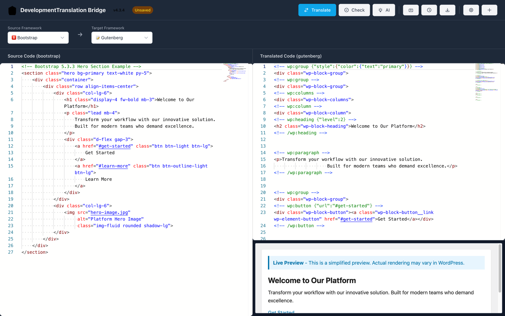
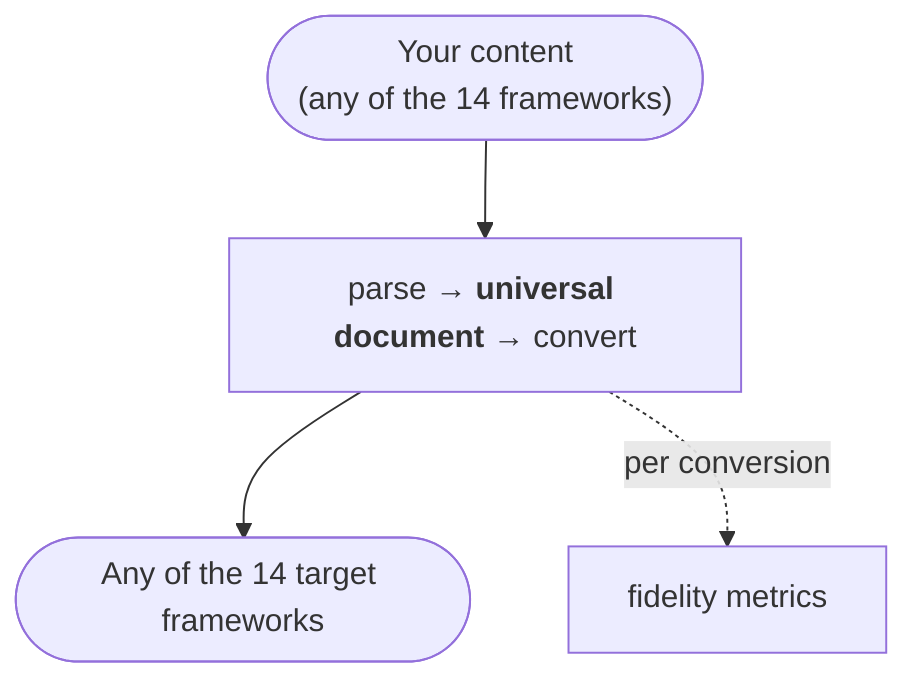
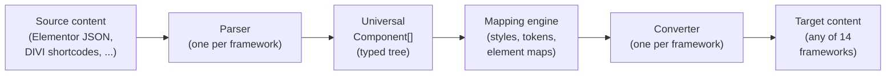

# DevelopmentTranslation Bridge

**Move a WordPress site from one page builder to another — without rebuilding
it by hand.** Translation Bridge converts content between 14 frameworks —
Elementor, DIVI, Gutenberg, Bricks, Oxygen, Avada, WPBakery, Beaver Builder,
Kadence, Thrive, Bootstrap, plus native support for the ground-up rewrites
(DIVI 5, Elementor 4 Atomic Editor, Oxygen 6).

[](https://github.com/coryhubbell/Development-Translation-Bridge/actions/workflows/ci.yml)
[](https://github.com/coryhubbell/Development-Translation-Bridge/releases/tag/v5.1.0)
[](https://github.com/coryhubbell/Development-Translation-Bridge/releases/tag/v5.1.0)
[](#requirements)
[](#requirements)
[](LICENSE)
[](#supported-frameworks)
[](#supported-frameworks)

**[Quick start](#quick-start) · [CLI reference](#cli) · [Python API](#python-api)
· [REST API](#rest-api) · [Architecture](#architecture) · [Latest release notes](https://github.com/coryhubbell/Development-Translation-Bridge/releases/latest)**



*The bundled Visual Interface (WordPress Admin → Visual Interface): Monaco-powered
side-by-side editing, framework selectors, live preview, and one-click
translate/check/AI actions.*

---

## ⚡ 30-second start

```bash
git clone https://github.com/coryhubbell/Development-Translation-Bridge.git
cd Development-Translation-Bridge && pip install -e .
./devtb transform elementor gutenberg your-page.json
```

That's it — `your-page-gutenberg.html` appears next to your input, with a
per-conversion fidelity report like `✓ Fidelity: 60/60 content strings
preserved (100.0%)`. Convert to **every** framework at once with
`./devtb transform-all elementor your-page.json`. Full setup (WordPress
theme, REST API, admin UI): see [Quick start](#quick-start).

---

## What it does

Translation Bridge takes content in any supported page builder's native format
(Elementor JSON, DIVI shortcodes, Gutenberg blocks, etc.) and re-emits it in
another framework's format. It runs as either a WordPress plugin (with a REST
API), a standalone CLI, or a Python library.

Typical situations it solves:

- **Builder migration.** A site built on Elementor needs to become
  Gutenberg-native (or Bricks, or anything else) — convert the pages instead
  of rebuilding them.
- **Version rewrites.** DIVI 4 → DIVI 5, Elementor 3 → Elementor 4 Atomic,
  Oxygen 4 → Oxygen 6: the successor formats are supported natively, so
  legacy content can be modernized in place.
- **Clean HTML output.** Emit framework-free Bootstrap 5 HTML from any
  builder — useful for handoffs, static exports, and AI/agentic content
  pipelines.
- **No silent data loss.** Elements without a native equivalent in the target
  framework are preserved and visibly annotated rather than dropped.

**One schema, two conforming runtimes.** Every conversion rides the same
lossless pipeline — parse → **universal document** → convert — whether it
runs in the Python engine or the PHP (WordPress) runtime. The legacy
mapping engine is gone as of 5.0:


```mermaid
flowchart TD
    IN(["Your content<br/>(any of the 14 frameworks)"]) --> P["parse → <b>universal document</b> → convert"]
    P --> OUT(["Any of the 14 target frameworks"])
    P -.->|"per conversion"| F["fidelity metrics"]
```

| Command | Engine | Status | Notes |
|---|---|---|---|
| `transform` | Python | **Recommended** | JSON-native, 100% metadata, ~0.5s/page |
| `transform-all` | Python | Supported | One source → every other framework, per-target fidelity table |

---

## Supported frameworks

14 frameworks → 182 translation pairs (`N × (N-1)`).

| Framework key | CMS version targeted | Format | Notes |
|---|---|---|---|
| `bootstrap` | Bootstrap 5.3.x | HTML | Universal output, AI-friendly |
| `elementor` | Elementor 3.30.0 | JSON | Section → Column → Widget |
| `elementor-4` | Elementor 4.0.0 | JSON | Atomic Editor (`e-div-block`, `e-flexbox`, `e-heading`...) |
| `divi` | DIVI 4.27.0 | Shortcodes | `[et_pb_*]` |
| `divi-5` | DIVI 5.0.0 | Block markup | `<!-- wp:divi/* -->` |
| `oxygen` | Oxygen 4.8.3 | JSON | Legacy `ct_*` schema |
| `oxygen-6` | Oxygen 6.0.0 | JSON tree | Breakdance-derived `EssentialElements\*` namespace |
| `gutenberg` | WordPress 6.9.0 | Block markup | Canonical core blocks |
| `bricks` | Bricks 2.3.5 | JSON | Flat element registry with `parent` ids |
| `kadence` | Kadence Blocks 3.7.2 | Block markup | `kadence/*` blocks + `core/*` fallthrough |
| `thrive` | Thrive Architect 10.8.10 | TCB HTML | `data-css` tokens + `tve_custom_style` |
| `wpbakery` | WPBakery 8.7.3 | Shortcodes | `[vc_*]` |
| `beaver-builder` | Beaver Builder 2.10.2 | JSON | |
| `avada` | Avada 7.15.3 | Shortcodes | `[fusion_*]` |

### Schema verification status

The `oxygen-6`, `divi-5`, and `elementor-4` paths shipped in v4.3.0 as
documentation-based proxies; they have since been **verified and corrected
against real evidence**:

- **`elementor-4`** — verified against the open-source
  [elementor/elementor](https://github.com/elementor/elementor) repository
  (`modules/atomic-widgets`): settings now use the real typed-prop system
  (`$$type` envelopes, `html-v3` content, `link.destination`,
  `Style_Definition` variants) and only real atomic element types are emitted.
- **`divi-5`** — verified against the Divi 5 block-format docs: content lives
  in the top-level `content` attribute group with unicode-escaped HTML and
  the responsive `desktop.value` wrapper.
- **`oxygen-6`** — node shape verified against a **real Breakdance element
  export** (committed at `tests/fixtures/oxygen6/`): integer ids,
  `data`-nested type/properties, `_parentId` back-references, and
  `content.content` field grouping. Oxygen 6 shares ~80% of Breakdance's
  codebase; if Oxygen 6 ships its own element namespace, the parser's
  namespace-agnostic lookup already handles it and the emitter's prefix is a
  single constant.

`tests/Unit/ProxySchemaVerificationTest.php` pins all of the above, including
parsing the real export end-to-end.

---

## Quick start

### Requirements

- PHP **8.1+** (for the WordPress runtime, theme install, and REST API)
- Python **3.9+** (for the `transform` path and CLI); local verification is pinned to **3.11** via `.python-version`
- Node **20.19.0**, **22.13.0+**, or **24+** + npm (only to rebuild the React admin UI from source)
- Composer 2.0+ and pip (only if installing from source)

### Install

```bash
git clone https://github.com/coryhubbell/Development-Translation-Bridge.git
cd Development-Translation-Bridge

# PHP dependencies
make composer-install

# Python package
pip install -e .

# Build the React admin UI (required for the Visual Interface in production).
# admin/dist/ is gitignored, so this step is needed after every clone or pull
# that touches admin/. In WP_DEBUG mode the Vite dev server is used instead;
# see admin/README.md for the dev workflow.
cd admin
npm ci
npm run build
cd ..

# Make the CLI executable
chmod +x devtb
```

Release assets named `development-translation-bridge-*.zip` are packaged for
WordPress theme installation. They are built reproducibly by
[`scripts/build-release-package.sh`](scripts/build-release-package.sh), and
pushing a `v*` tag publishes the release automatically (zip + generated
changelog) via the release workflow. Clone the repository when you need the
standalone CLI, Python package, tests, or development tooling.

To run the full local release gate before opening or updating a PR:

```bash
make verify
```

### Choosing a command

| You want to… | Run |
|---|---|
| Convert one file to one framework | `./devtb transform <source> <target> <file>` |
| Convert one file to **all 13 other frameworks** | `./devtb transform-all <source> <file>` |
| Convert a whole directory or site export | `./devtb transform-site <source> <target> <dir>` |
| Inspect content without converting | `./devtb analyze <framework> <file>` |
| List the 14 framework keys | `./devtb list-frameworks` |
| Check a file parses as a framework | `./devtb validate <framework> <file>` |

Every conversion prints a fidelity line (content strings preserved). If a
target has no native slot for something, it is preserved and visibly
annotated — never silently dropped.

### Translate a file

```bash
# JSON-native transform (recommended for JSON-based frameworks)
./devtb transform elementor bootstrap input.json -o output.html

# fan out to every framework at once (per-target fidelity table)
./devtb transform-all divi input.html

# Transform an entire site export
./devtb transform-site elementor bootstrap ./export-kit/

# Analyze content without converting
./devtb analyze elementor input.json
```

### From Python

```python
from translation_bridge.converters.bootstrap import BootstrapConverter
from translation_bridge.converters.elementor4 import Elementor4Converter

# Parse Elementor JSON, emit Bootstrap HTML
elementor_data = [...]  # parsed JSON
html = BootstrapConverter().convert(elementor_data)

# Build Atomic Editor JSON from any parsed universal data
atomic_json = Elementor4Converter().convert(elementor_data)
```

### As a WordPress plugin

```bash
# Activate by copying or symlinking into wp-content/themes/
ln -s "$PWD" /path/to/wp-content/themes/development-translation-bridge

# Then activate "DevelopmentTranslation Bridge" in WordPress Admin → Themes.
```

The REST API mounts at `/wp-json/devtb/v2/*` after activation (see
[REST API](#rest-api) below).

---

## CLI

The `devtb` CLI is a bash wrapper that routes commands to the Python engine
(conversions) or the PHP engine (WordPress runtime utilities).

```text
COMMANDS (Python engine — JSON-native, lossless):
  transform <source> <target> <file>      Transform a file (100% metadata preserved)
  transform-all <source> <file>           Transform to every other framework
  transform-site <source> <target> <dir>  Transform every file in a directory
  analyze <framework> <file>              Inspect parsed content without converting

COMMANDS (PHP engine utilities):
  list-frameworks                         List supported frameworks
  validate <framework> <file>             Validate file format

OPTIONS:
  -h, --help                              Show this help message
  -v, --version                           Show version information
  -n, --dry-run                           Preview without writing files
  -d, --debug                             Show debug information
  -o, --output <file>                     Specify output file path
```

Run `./devtb --help` for the current up-to-date command list.

### Common workflows

```bash
# Migrate Elementor → Bricks
./devtb transform elementor bricks page.json -o page-bricks.json

# Modernize legacy DIVI 4 → DIVI 5 block markup
./devtb transform divi divi-5 page.txt -o page-divi5.html

# Detect format, then route to the right path
./devtb analyze elementor mystery.json  # tells you elType, version, etc.

# Generate every framework's version from one input (fidelity table included)
./devtb transform-all bootstrap landing.html
```

---

## Python API

Direct module imports for programmatic use:

```python
from translation_bridge.converters.bootstrap import BootstrapConverter
from translation_bridge.converters.elementor   import ElementorConverter
from translation_bridge.converters.elementor4  import Elementor4Converter
from translation_bridge.converters.divi        import DiviConverter
from translation_bridge.converters.divi5       import Divi5Converter
from translation_bridge.converters.gutenberg   import GutenbergConverter
from translation_bridge.converters.bricks      import BricksConverter
from translation_bridge.converters.oxygen      import OxygenConverter
from translation_bridge.converters.oxygen6    import Oxygen6Converter
from translation_bridge.converters.wpbakery    import WPBakeryConverter
from translation_bridge.converters.beaver      import BeaverConverter
from translation_bridge.converters.avada       import AvadaConverter
from translation_bridge.converters.kadence     import KadenceConverter
from translation_bridge.converters.thrive      import ThriveConverter

# Each converter has the same surface:
converter = BricksConverter()
output_json = converter.convert(parsed_data)       # serialized
output_list = converter.convert_to_dict(parsed_data)  # python objects
framework_name = converter.get_framework()          # "bricks"
```

Site-level conversions:

```python
from translation_bridge.parsers.elementor_site import ElementorSiteParser
from translation_bridge.converters.styles      import StylesConverter
from translation_bridge.converters.templates   import TemplateConverter

site = ElementorSiteParser().parse_kit("./export-kit/")
tokens = StylesConverter().extract_tokens(site.settings)
template_parts = TemplateConverter().build(site.templates)
```

---

## REST API

After activating the WordPress theme/plugin, endpoints mount at
`/wp-json/devtb/v2/*`.

### Endpoints

| Method | Path | Purpose |
|---|---|---|
| GET | `/status` | Health check + version info |
| GET | `/frameworks` | List supported frameworks |
| POST | `/translate` | Translate a single payload |
| POST | `/batch-translate` | Queue a batch translation job |
| GET | `/job/{job_id}` | Poll a batch job's status |
| POST | `/validate` | Validate a payload for a framework |
| POST | `/save` | Persist a translation result |
| GET, PUT, DELETE | `/translations/{id}` | CRUD on saved translations |
| GET | `/translations/history` | List recent translations |
| GET | `/translations/{id}/versions` | Version history for a translation |
| GET, POST | `/api-keys` | List or create API keys |
| DELETE | `/api-keys/{key}` | Revoke an API key |

### Authentication

API keys are encrypted at rest (AES-256-CBC) and required for every endpoint
except `/status` and `/frameworks`. Pass via header:

```http
Authorization: Bearer <api-key>
```

Generate keys via the WordPress admin UI or `POST /wp-json/devtb/v2/api-keys`.

### Quick examples

```bash
# Health check
curl https://example.com/wp-json/devtb/v2/status

# List frameworks
curl https://example.com/wp-json/devtb/v2/frameworks

# Translate
curl -X POST https://example.com/wp-json/devtb/v2/translate \
  -H "Authorization: Bearer $DEVTB_API_KEY" \
  -H "Content-Type: application/json" \
  -d '{"source":"elementor","target":"bootstrap","content":"..."}'
```

Full endpoint reference: [`docs/api-v2.md`](docs/api-v2.md).

---

## Architecture

Every framework plugs into the same hub-and-spoke pipeline: parse into a
universal component tree, map, then convert out. Adding one framework adds
13 × 2 new translation pairs — no per-pair code.


```mermaid
flowchart LR
    A["Source content<br/>(Elementor JSON,<br/>DIVI shortcodes, ...)"] --> B["Parser<br/>(one per framework)"]
    B --> C["Universal<br/>Component[]<br/>(typed tree)"]
    C --> D["Mapping engine<br/>(styles, tokens,<br/>element maps)"]
    D --> E["Converter<br/>(one per framework)"]
    E --> F["Target content<br/>(any of 14<br/>frameworks)"]
```

Each framework provides a paired **parser** (input → universal components)
and **converter** (universal components → output). Parsers and converters
register independently with `DEVTB_Parser_Factory` and
`DEVTB_Converter_Factory`, so a framework can be a source, a target, or both.

### Project layout

```
translation-bridge/
├── core/
│   ├── interface-parser.php
│   ├── interface-converter.php
│   ├── class-parser-factory.php
│   ├── class-converter-factory.php
│   ├── class-mapping-engine.php
│   └── class-translator.php
├── parsers/        # one per framework (PHP)
├── converters/     # one per framework (PHP)
├── models/         # DEVTB_Component
└── utils/          # CSS, JSON, HTML, shortcode helpers

src/translation_bridge/
├── parsers/        # Python parsers
├── converters/     # Python converters
├── transforms/     # Zone Theory engine (v4)
└── cli.py          # Python CLI entry point

includes/
├── class-devtb-api-v2.php        # REST API
├── class-devtb-auth.php          # API key + permission checks
├── class-devtb-encryption.php    # AES-256-CBC for keys at rest
├── class-devtb-rate-limiter.php
├── class-devtb-job-queue.php     # async batch translations
└── class-devtb-webhook.php
```

Detailed architecture notes live in [`docs/TRANSLATION_BRIDGE.md`](docs/TRANSLATION_BRIDGE.md).

---

## Testing

PHP (via PHPUnit):

```bash
make test-php                  # full suite
vendor/bin/phpunit --filter FrameworkConversionsTest  # 182-pair matrix
```

Python (via pytest):

```bash
python3 -m pytest tests/python -q
```

Full local release gate:

```bash
make verify
```

As of v5.1.0:
- PHP: **344 tests / 5,691 assertions / 0 errors / 0 failures / 0 deprecations**,
  including 18 widget-coverage tests (`tests/Unit/GutenbergWidgetCoverageTest.php`),
  9 real-format schema-verification tests (`tests/Unit/ProxySchemaVerificationTest.php`),
  8 responsive round-trip tests (`tests/Unit/ResponsiveRoundTripTest.php`),
  and 9 classic-Oxygen hardening tests (`tests/Unit/OxygenClassicHardeningTest.php`).
- Python: 307 tests across converters, parsers (all 14 frameworks parse natively), transforms, responsive helpers, the bidirectional interchange, the translate-path deprecation surfaces, the 39-cell cross-source fidelity matrix, dual-engine conformance (including the exact-mirror gate), and project alignment checks.
- End-to-end fidelity smoke gates (`make e2e-smoke`), each running through
  both engines as CI gates on every push and PR: Elementor → Gutenberg
  (`tests/smoke_gutenberg_e2e.py`), Elementor → Bricks
  (`tests/smoke_bricks_e2e.py`, flat-format + content survival), and
  DIVI → Gutenberg (`tests/smoke_divi_e2e.py`, content survival + block
  integrity).

The 41 pre-existing errors and 3 failures that v4.1 / v4.2 / v4.3.0 inherited
(class-autoload mismatches and missing WP-function mocks) were all resolved in
v4.3.1 via the shared autoloader + WP function stubs. The full suite is now
green, including `composer audit`.

### Continuous integration

Every push and PR to `main` / `develop` runs four jobs
([`.github/workflows/ci.yml`](.github/workflows/ci.yml)):

| Job | What it runs |
|---|---|
| **PHP tests** | PHPUnit across PHP **8.1 – 8.5**, plus composer validate, syntax check, `composer audit`, PHPCS (WordPress standards), and Codecov coverage upload |
| **Python tests + Gutenberg e2e smoke** | Full pytest suite, then three e2e fidelity gates through both engines: Elementor → Gutenberg, Elementor → Bricks, and DIVI → Gutenberg kitchen-sink fixtures |
| **Admin build** | ESLint, `tsc --noEmit`, and a production Vite build on Node **20.19.0 / 22.13.0 / 24** |
| **Release package smoke** | Builds and inspects the WordPress theme zip via `scripts/build-release-package.sh`, so packaging breakage is caught before tagging |

Dependency freshness is automated with
[Dependabot](.github/dependabot.yml): weekly update PRs for Composer, npm
(`admin/`), and pip, and monthly for GitHub Actions and Docker Compose images.
`composer audit` gates every CI run, and `make verify` additionally runs
`npm audit --omit=dev` on the admin UI.

---

## Docker (development)

A local stack is available for plugin development:

```bash
docker-compose up -d

# WordPress:    http://localhost:8080
# phpMyAdmin:   http://localhost:8081
```

The stack pins WordPress 7.0 (PHP 8.4 + Apache), MySQL 9.7, and phpMyAdmin
5.2 — image versions are kept fresh by Dependabot's monthly
`docker-compose` updates. Ports and database credentials are overridable via
environment variables (`WORDPRESS_PORT`, `MYSQL_PORT`, `MYSQL_USER`, ...);
see [`docker-compose.yml`](docker-compose.yml) for the full list and
[`DOCKER_SETUP.md`](DOCKER_SETUP.md) for a walkthrough.

The plugin is mounted from the working tree, so edits are reflected
immediately.

---

## Documentation

Topical guides under [`docs/`](docs):

| File | Topic |
|---|---|
| [`getting-started.md`](docs/getting-started.md) | First-run setup walkthrough |
| [`api-v2.md`](docs/api-v2.md) | Full REST API reference |
| [`api-development.md`](docs/api-development.md) | Building against the API |
| [`TRANSLATION_BRIDGE.md`](docs/TRANSLATION_BRIDGE.md) | Architecture deep-dive |
| [`FRAMEWORK_MAPPINGS.md`](docs/FRAMEWORK_MAPPINGS.md) | Per-framework element maps |
| [`CONVERSION_EXAMPLES.md`](docs/CONVERSION_EXAMPLES.md) | Real translation examples |
| [`bootstrap-components.md`](docs/bootstrap-components.md) | Bootstrap output reference |
| [`claude-integration.md`](docs/claude-integration.md) | AI-assisted editing workflows |
| [`PLUGIN_CONVERSION.md`](docs/PLUGIN_CONVERSION.md) | Plugin migration cookbook |

A consolidated version history lives in [`CHANGELOG.md`](CHANGELOG.md);
detailed notes for major releases live at [`RELEASE_NOTES_V*.md`](.) and in
[GitHub Releases](https://github.com/coryhubbell/Development-Translation-Bridge/releases).

---

## Current release: v5.1.0 (production-ready)

**v5.1.0 closes the deprecation window and ships `transform-all`.** One
command now fans a page out to every other framework with a per-target
fidelity table; the legacy `translate`/`translate-all` commands are
removed on schedule. Full notes:
[v5.1.0 release](https://github.com/coryhubbell/Development-Translation-Bridge/releases/tag/v5.1.0)
and [`RELEASE_NOTES_V5.1.0.md`](RELEASE_NOTES_V5.1.0.md).

### What 5.1.0 added

- **`devtb transform-all <source> <file>`** — one source → all 13 other
  frameworks through the universal route, per-target fidelity table.
- **Removed:** the `translate`/`translate-all` CLI commands (deprecated
  since 4.14.0). The WordPress runtime engine is unaffected.
- **Fixed:** `list-frameworks`/`validate` are supported utilities, not
  deprecated; help corrected.

### What 5.0.0 changed (RFC 5.0 complete)

- **Removed (breaking):** the v3 mapping engine and its fallback branch;
  the `DEVTB_Component` shape as a public interchange format.
- **Unchanged:** every CLI command, REST endpoint, and API signature.
- **Migration:** direct `DEVTB_Mapping_Engine` users move to
  `parse_to_universal()` / `translate_universal()`; stats `route` is
  always `universal`.

<details>
<summary><b>Release history highlights (v4.3.0 → v4.15.0)</b></summary>

### What 4.15.0 added (pre-5.0 converter hardening)

- **Cross-source fidelity matrix:** 3 real fixtures × 14 targets,
  ≥90% content survival per pair, gating in CI.
- **All 14 converters hardened:** structural recursion for nested
  container shapes, canonical widget vocabulary, content-preserving
  fallbacks — no empty elements for unmapped widgets.
- **Bidirectional interchange:** `element_to_component` /
  `document_to_components` mirror `DEVTB_Universal`'s reverse direction.
- **Honest metrics:** style keys excluded from content; JSON outputs
  compared via decoded string scalars.

### What 4.14.0 added (RFC 5.0 Phase 3 complete)

- **The universal route everywhere:** `DEVTB_Translator::translate()`
  normalizes through the canonical universal document instead of the v3
  fuzzy mapping engine — all 182 pairs green.
- **Fidelity metrics per conversion:** route + content-string survival in
  translator stats and both CLIs.
- **`translate` deprecated:** notices on every surface; Python CLI accepts
  it as an alias of `transform`; unregistered Python pairs convert through
  the universal route behind a runtime fidelity gate.
- **Fixed:** `devtb-php` silent-exit bug (missing `DEVTB_CLI` constant)
  that killed CLI conversions touching the responsive helper.

### What 4.13.0 added (RFC 5.0 Phase 2 complete)

- **Shared interchange module:** `src/translation_bridge/interchange.py` —
  component-shaped dicts translate to canonical universal elements with
  PHP-identical semantics; the Gutenberg converter's ad-hoc adapter is
  replaced by delegation to it.
- **Exact-mirror conformance gate:**
  `component_to_element(to_array()) == to_universal()` for every component
  of all three real fixtures, on every CI run.
- **Round-trip vocabulary completed in both engines:** `icon_list`,
  `wp_gallery`, `selected_icon`, `alert_*`, and CTA links survive
  universal ⇄ component conversion.
- **Better legacy output:** `row`/`column` components become real
  `core/columns` blocks; the schema-canonical `nav` widgetType is accepted.

### What 4.12.0 added (RFC 5.0 Phases 1–2)

- **The spec:** `schema/universal-element.schema.json` +
  [`docs/RFC-5.0-engine-consolidation.md`](docs/RFC-5.0-engine-consolidation.md).
- **Conformance in CI:** three real fixtures parsed by both engines must
  produce schema-valid, content-equivalent documents.
- **Universal interchange in PHP:** `DEVTB_Universal`,
  `parse_to_universal()` / `translate_universal()`, and `universal` as a
  REST source/target.
- **Cross-engine proof:** Python-parsed → PHP-converted and PHP-parsed →
  Python-converted, both content-preserving. Purely additive.

### What 4.11.0 added (Python parsers final tranche)

- **Seven new parsers:** DIVI 4, WPBakery, and Avada (shared shortcode
  tokenizer with self-closing-leaf handling); Kadence (extends the
  Gutenberg parser); Beaver Builder (flat node registry); Thrive and
  Bootstrap (shared HTML walker).
- **13 new transform pairs** and CLI resolution; verified against the
  committed DIVI kitchen-sink fixture and the repo's real Bootstrap hero
  example. Purely additive.

### What 4.10.0 added (Python parsers tranche 2)

- **`Oxygen6Parser`** — the Breakdance-verified node shape, all envelope
  variants, design breakpoints canonicalizing; parses the committed real
  export fixture end to end.
- **`Divi5Parser`** — `wp:divi/*` markup per the verified format, with
  tablet/phone/hover wrappers canonicalizing.
- **`GutenbergParser`** — core block markup as a lossless source; unknown
  blocks preserved verbatim.
- Shared block tokenizer, parse-direction responsive helpers, seven new
  transform pairs, CLI aliases. Purely additive.

### What 4.9.0 added (responsive canonicalization completion)

- **Elementor v3:** `_tablet`/`_mobile`/`_hover` setting suffixes
  canonicalize on parse and re-emit on convert, in both engines.
- **Bricks:** `:tablet_portrait`/`:mobile_portrait` setting-key suffixes
  canonicalize and re-emit in both engines; `mobile_landscape` passes
  through verbatim.
- **Cross-framework transfer in every direction** — e.g. Elementor tablet
  overrides become Bricks `:tablet_portrait` keys, and either can land in
  DIVI 5 wrappers, Elementor 4 variants, or Oxygen `media` bags. Purely
  additive: non-responsive content converts byte-identically.

### What 4.8.0 added (e2e fidelity smoke gates)

- **Two new gates:** Elementor → Bricks (flat-format integrity + content
  survival) and DIVI → Gutenberg (new 17-module DIVI kitchen-sink fixture;
  content survival + block integrity, both Gutenberg converters).
- **Seven content drops fixed:** Bricks converters (Python widget branches,
  PHP gallery arrays) and Gutenberg converters (container recursion,
  universal attribute vocabulary, button labels, toggle panels, testimonial
  citations).
- `make e2e-smoke` runs all three gates locally; `make verify` and CI
  include them.

### What 4.7.0 added (JSON source parsers)

- **Three new source parsers** on the lossless Python engine, built on
  schemas verified in earlier releases: `BricksParser` (real 2.x flat page
  format), `OxygenParser` (all four classic storage shapes, with unit
  normalization and responsive `media` canonicalization), and
  `Elementor4Parser` (typed-prop unwrapping + style-variant
  canonicalization).
- **CLI wiring:** `devtb transform bricks|oxygen|elementor4 <target>
  file.json` works end to end; five new transform pairs registered
  (each source → `gutenberg` / `bootstrap`).
- **Shared `UniversalDocument` primitives** so the next source parser is a
  much smaller diff.
- Purely additive — no existing transform or converter behavior changed.

### What 4.6.0 added (classic Oxygen hardening)

- **All four real storage shapes parse** — the nested `ct_builder_json` root
  tree, the `ct_builder_json` wrapper, the flat `ct_parent` list, and
  `ct_builder_shortcodes` strings. (Previously only the flat list parsed —
  the committed fixture itself was unreadable.)
- **Real element vocabulary** — `ct_link`, `ct_new_columns`/`ct_column`,
  `oxy_rich_text`, `oxy_testimonial_box`, `oxy_map`, `oxy_nav_menu`, and the
  rest of the genuine `ct_*`/`oxy_*` set; nine fabricated names earlier
  releases emitted still parse as aliases but are never emitted again.
- **One output shape across engines** — PHP and Python now emit the identical
  real root-tree format with correct `ct_id`/`ct_parent` linkage (previously
  three mutually incompatible shapes).
- **Style + responsive fidelity** — full `options.original` passthrough
  (the old allow-list silently dropped `gap`, `border` shorthand, and more),
  unit normalization both ways (Oxygen unitless ↔ CSS px), and
  `options.media` breakpoint overrides round-tripping via the canonical
  responsive model.
- **Deterministic output** — `time()`-based selectors removed; conversions
  are byte-reproducible.

### What 4.5.0 added (responsive breakpoint round-tripping)

- **Canonical responsive model** — breakpoints `desktop`/`tablet`/`phone`,
  states `default`/`hover` — carried in component metadata, implemented on
  both engines (`DEVTB_Responsive_Helper` in PHP,
  `translation_bridge.responsive` in Python).
- **DIVI 5:** per-breakpoint content values and hover states parse into
  canonical form and re-emit as full multi-breakpoint wrappers.
- **Elementor 4:** style-definition variants canonicalize per
  breakpoint/state (`mobile` ↔ `phone`) and re-emit as one variant each.
- **Oxygen 6:** design-tree `breakpoint_*` leaves flatten to canonical props
  and re-nest on emit — design data now round-trips at all.
- **Cross-framework transfer:** responsive styling moves between frameworks
  (e.g. Oxygen 6 design breakpoints → Elementor 4 variants), tested in both
  directions. Purely additive — elements without responsive data emit
  byte-identical output to v4.4.0.

### What 4.4.0 added (real-format schema verification)

The three next-generation framework paths shipped in v4.3.0 as
documentation-based proxies; v4.4.0 corrects each against real evidence:

- **Elementor 4 — verified against the open-source elementor repo**
  (`modules/atomic-widgets`). Settings now use the real typed-prop system:
  every value wrapped in a `{"$$type": ..., "value": ...}` envelope,
  `html-v3` content props, the `paragraph` settings key,
  `link.destination`/`isTargetBlank`, the nested `image.src` shape, and
  `Style_Definition` variants referenced via the `classes` prop. Emissions
  use only real atomic element types — `e-svg`, `e-youtube`,
  `e-self-hosted-video`, `e-divider` replace the invented
  `e-icon`/`e-video`/`e-list`.
- **DIVI 5 — verified against the Divi 5 block-format docs.** Content moved
  to the top-level `content` attribute group (was `module.content`), and
  block attrs now unicode-escape HTML exactly like WP core's
  `serialize_block_attributes()`, so content can never break the
  block-comment delimiters. The responsive `desktop.value` wrapper was
  confirmed correct as shipped.
- **Oxygen 6 — verified against a real Breakdance export** (committed,
  scrubbed, at `tests/fixtures/oxygen6/`). Nodes carry integer ids with the
  element payload nested under `data`, `_parentId` back-references, a
  `tree.root` envelope, `content.content` field grouping, the plural `tags`
  heading key, and real element names (`CodeBlock`, `TextLink`,
  `PricingTable`, `ProgressBar`).
- **Back-compat preserved:** parsers accept both the real shapes and the old
  proxy shapes, so v4.3.x output still translates. Nine new
  schema-verification tests pin the real formats — including parsing the
  real export end-to-end.
- **Release engineering:** Dependabot across five ecosystems, reproducible
  zip packaging (`scripts/build-release-package.sh` + tag-triggered
  releases), the four-job CI pipeline, and `make verify`.

### What 4.3.4 added (Elementor → Gutenberg widget coverage)

- **Widget coverage on both engines.** ~70 of the 90+ universal widget types
  the Elementor parser produces were previously silently collapsing onto
  `core/paragraph` with empty content. Compound widgets (`tabs`, `accordion`,
  `card`, `cta`, `counter`, `testimonial`, `pricing-table`, `alert`) now
  expand into native block groups with a `devtb-<type>-converted` className.
  Widgets with no native Gutenberg equivalent (`form`, `slider`, `countdown`,
  `portfolio`, `toc`, `map`, `progress`, `rating`, unknown widgets) are
  preserved as `core/html` with a visible `data-devtb-source` annotation —
  no silent data loss.
- **Type-map expansion** for 1:1 mappings the parser produced but the
  converter was missing (`social-icons`, `nav`, `blockquote`, `icon`).
- **Settings denormalization** (typography, color, spacing, border,
  className, anchor) restored on the Python side — these were silently
  dropped before.
- **Four new transforms registered:** `elementor_to_gutenberg`,
  `html_to_gutenberg`, `divi_to_gutenberg`, `bricks_to_gutenberg`.
- **CI gate:** kitchen-sink fixture (30 widget types, every dispatch class)
  now runs through both engines on every push and PR via the new
  `Python tests + Gutenberg e2e smoke` job. The smoke caught two real
  fidelity bugs (counter title, blockquote author) that the targeted unit
  tests didn't reach — both fixed before tagging.

Full notes: [v4.3.4 release](https://github.com/coryhubbell/Development-Translation-Bridge/releases/tag/v4.3.4)
and [`RELEASE_NOTES_V4.3.4.md`](RELEASE_NOTES_V4.3.4.md).

### What 4.3.0 added (framework coverage milestone)

- **3 new frameworks:** `divi-5`, `elementor-4`, `oxygen-6` — native parser +
  converter pairs for the block-based / atomic rewrites.
- **Bricks correctness fix:** PHP converter now emits the flat 2.x page
  format (string `parent` ids, child id arrays) matching real Bricks output.
  Previous nested-children output was wrong against every Bricks version.
- **Automatic routing:** legacy DIVI and Elementor parsers detect their
  successor format and route to the new parser instead of attempting an
  incompatible parse.
- **Framework matrix:** 11 → 14 frameworks, 110 → 182 translation pairs.

### What 4.3.1 → 4.3.3 added (production-readiness chain)

- **CLI translation fatal fixed** (`v4.3.1`): the inline autoloader mangled
  namespaced class names — replaced with a shared autoloader used by CLI,
  PHPUnit, and (defense-in-depth) WordPress.
- **Matrix consistency across all surfaces** (`v4.3.1`): REST API, CLI,
  file-handler, config class, admin TypeScript, Monaco language map — all now
  derive from `DEVTB_Converter_Factory::get_framework_info()`. Stale `claude`
  pseudo-framework purged from every consumer.
- **Test suite green** (`v4.3.1`): 41 errors + 3 failures → **0 / 0** (284
  tests, 4,133 assertions). PHP 8.5 deprecation count → 0.
- **PHP 8.1+ floor declared** (`v4.3.1`): matches the tested runtime; PHP 7.4
  EOL'd 2022-11.
- **Security** (`v4.3.1`): CVE-2026-24765 (unsafe deserialization in PHPT
  coverage) cleared by phpunit bump to 9.6.34.
- **User-facing copy synced to 14 / 182** (`v4.3.2`): style.css framework
  list, ASCII banner, admin help text, CLI help text.
- **`functions.php` admin pages factory-driven** (`v4.3.3`): five hardcoded
  9-framework call sites (admin home, Frameworks matrix table, Settings
  select, System Status rows, Framework Details card) now consume the factory
  directly. Adding a 15th framework later only requires updating the factory.

v4.3.1 → v4.3.3 notes: [v4.3.3 release](https://github.com/coryhubbell/Development-Translation-Bridge/releases/tag/v4.3.3) — see also [`CODEX_REVIEW.md`](CODEX_REVIEW.md) for file-by-file rationale.

</details>

---

## Version history

| Version | Date | Highlights |
|---|---|---|
| [v5.1.0](https://github.com/coryhubbell/Development-Translation-Bridge/releases/tag/v5.1.0) **(latest)** | 2026-07-04 | `transform-all` fan-out with per-target fidelity; translate/translate-all removed on schedule |
| [v5.0.0](https://github.com/coryhubbell/Development-Translation-Bridge/releases/tag/v5.0.0) | 2026-07-04 | RFC 5.0 complete — one schema, two conforming runtimes; v3 mapping engine removed (breaking); migration guide in release notes |
| [v4.15.0](https://github.com/coryhubbell/Development-Translation-Bridge/releases/tag/v4.15.0) | 2026-07-04 | Pre-5.0 converter hardening: Python cross-source parity, 39-cell fidelity matrix in CI, bidirectional interchange |
| [v4.14.0](https://github.com/coryhubbell/Development-Translation-Bridge/releases/tag/v4.14.0) | 2026-07-04 | RFC 5.0 Phase 3 complete: universal route everywhere, fidelity metrics per conversion, `translate` deprecated, silent-exit CLI fix |
| [v4.13.0](https://github.com/coryhubbell/Development-Translation-Bridge/releases/tag/v4.13.0) | 2026-07-03 | RFC 5.0 Phase 2 complete: shared component interchange in Python, exact-mirror conformance gate, round-trip vocabulary completed in both engines |
| [v4.12.0](https://github.com/coryhubbell/Development-Translation-Bridge/releases/tag/v4.12.0) | 2026-07-03 | RFC 5.0 Phases 1–2: canonical schema, dual-engine conformance in CI, universal interchange in the PHP engine + REST |
| [v4.11.0](https://github.com/coryhubbell/Development-Translation-Bridge/releases/tag/v4.11.0) | 2026-07-03 | Python parsers final tranche: all 14 frameworks parse natively — the 4.7+ roadmap is complete |
| [v4.10.0](https://github.com/coryhubbell/Development-Translation-Bridge/releases/tag/v4.10.0) | 2026-07-03 | Python parsers tranche 2: Oxygen 6, DIVI 5, and Gutenberg sources — all JSON/block-markup formats parse natively in Python |
| [v4.9.0](https://github.com/coryhubbell/Development-Translation-Bridge/releases/tag/v4.9.0) | 2026-07-03 | Responsive canonicalization completed: Elementor v3 suffixes + Bricks breakpoint keys join the canonical model; cross-framework transfer in every direction |
| [v4.8.0](https://github.com/coryhubbell/Development-Translation-Bridge/releases/tag/v4.8.0) | 2026-07-03 | E2e fidelity smoke gates for Elementor → Bricks and DIVI → Gutenberg; seven content drops caught and fixed |
| [v4.7.0](https://github.com/coryhubbell/Development-Translation-Bridge/releases/tag/v4.7.0) | 2026-07-03 | JSON source parsers: Bricks, classic Oxygen, and Elementor 4 Atomic now ride the lossless `transform` path as sources |
| [v4.6.0](https://github.com/coryhubbell/Development-Translation-Bridge/releases/tag/v4.6.0) | 2026-07-03 | Classic Oxygen hardening: all real storage shapes parse, real `ct_*`/`oxy_*` vocabulary, unified root-tree output, full style passthrough, responsive `media` round-tripping |
| [v4.5.0](https://github.com/coryhubbell/Development-Translation-Bridge/releases/tag/v4.5.0) | 2026-07-03 | Responsive breakpoint round-tripping: canonical desktop/tablet/phone + hover model for `divi-5` / `elementor-4` / `oxygen-6`, with cross-framework transfer |
| [v4.4.0](https://github.com/coryhubbell/Development-Translation-Bridge/releases/tag/v4.4.0) | 2026-07-02 | `divi-5` / `elementor-4` / `oxygen-6` schemas verified against real formats (elementor repo, Divi 5 docs, real Breakdance export); Dependabot, reproducible packaging, four-job CI, `make verify` |
| [v4.3.4](https://github.com/coryhubbell/Development-Translation-Bridge/releases/tag/v4.3.4) | 2026-05-20 | Elementor → Gutenberg widget coverage hotfix (compound widgets, marker fallback, settings denormalization); e2e smoke harness now a CI gate |
| [v4.3.3](https://github.com/coryhubbell/Development-Translation-Bridge/releases/tag/v4.3.3) | 2026-05-19 | `functions.php` admin pages now factory-driven; eliminates drift surface for framework lists |
| [v4.3.2](https://github.com/coryhubbell/Development-Translation-Bridge/releases/tag/v4.3.2) | 2026-05-19 | User-facing copy errata (style.css, admin help, CLI help); 9 → 14 / 72 → 182 |
| [v4.3.1](https://github.com/coryhubbell/Development-Translation-Bridge/releases/tag/v4.3.1) | 2026-05-19 | Production-readiness: CLI fatal fix, matrix consistency, test suite green, PHP 8.1 floor, CVE-2026-24765 cleared |
| [v4.3.0](https://github.com/coryhubbell/Development-Translation-Bridge/releases/tag/v4.3.0) | 2026-05-19 | DIVI 5, Elementor 4 Atomic, Oxygen 6 native parsers; Bricks flat-output fix |
| [v4.2.0](https://github.com/coryhubbell/Development-Translation-Bridge/releases/tag/v4.2.0) | 2026-05-18 | Kadence + Thrive converters; CMS version re-association; correctness audit |
| [v4.1.0](https://github.com/coryhubbell/Development-Translation-Bridge/releases/tag/v4.1.0) | 2026-01-17 | 8 Python converters; site-level parser; styles & template extraction |
| [v4.0.0](https://github.com/coryhubbell/Development-Translation-Bridge/releases/tag/v4.0.0) | 2025-Q4 | JSON-native transform engine; Zone Theory; 100% metadata preservation |

---

## Roadmap

The 4.x line is feature-complete on framework coverage and production-ready
as of v5.1.0. Release verification is automated end to end — Dependabot
keeps dependencies fresh, `make verify` mirrors the release gate locally, and
the four-job CI pipeline (including release-package smoke) runs on every push
and PR. The v4.3.0 proxy schemas were verified against real formats in v4.4.0
(see [Schema verification status](#schema-verification-status)), and v4.5.0
added responsive breakpoint round-tripping: tablet/phone breakpoints and
hover states survive round trips for all three paths and transfer across
frameworks through a canonical responsive model.

On Oxygen: classic Oxygen (4.x) support is fully hardened — real `ct_*`/`oxy_*`
vocabulary, every storage shape (JSON tree, wrapper, flat list, shortcodes),
full style passthrough with unit normalization, and responsive `media`
round-tripping. The `oxygen-6` path intentionally tracks the verified
Breakdance-derived schema (~80% shared codebase) rather than chasing
Oxygen 6-specific deltas.

### Next (4.7+)

Candidate work for upcoming 4.x releases, roughly in priority order:

1. ~~**More JSON source parsers for the lossless `transform` path.**~~
   **Done in v4.7.0:** Bricks, classic Oxygen, and Elementor 4 Atomic now
   parse into the universal shape and ride the 100%-metadata Python engine as
   sources (`devtb transform bricks|oxygen|elementor4 <target> file.json`).
2. ~~**E2e fidelity smoke gates for more targets.**~~ **Done in v4.8.0:**
   Elementor → Bricks and DIVI → Gutenberg kitchen-sink gates now run through
   both engines on every push/PR alongside the original Elementor → Gutenberg
   gate — and caught seven real content drops on their first run.
3. ~~**Responsive canonicalization for the remaining frameworks.**~~
   **Done in v4.9.0:** Elementor v3's `_tablet`/`_mobile`/`_hover` setting
   suffixes and Bricks' `:breakpoint` setting keys now canonicalize on parse
   and re-emit on convert, so responsive data survives round trips and
   transfers across frameworks (e.g. Elementor tablet overrides become
   Bricks `:tablet_portrait` keys).
4. ~~**Python parsers for the remaining frameworks.**~~ **Done in v4.11.0:**
   all 14 frameworks now parse natively in Python — JSON, block markup,
   shortcodes, and HTML — completing the parser half of the 5.x engine
   consolidation.

### 5.x — engine consolidation (Phase 1 underway)

The 5.x line consolidates both engines onto a single shared schema and
retires the lossy HTML-intermediate path. The plan lives in
[`docs/RFC-5.0-engine-consolidation.md`](docs/RFC-5.0-engine-consolidation.md);
the canonical interchange shape is normatively specified in
[`schema/universal-element.schema.json`](schema/universal-element.schema.json).

- **Phase 1 (shipped, unreleased):** the schema spec,
  `DEVTB_Component::to_universal()` on the PHP side, and a dual-engine
  conformance suite — shared real fixtures parsed by BOTH engines must
  produce schema-valid, content-equivalent universal documents.
- **Phase 2 (core shipped, unreleased):** `DEVTB_Universal` bridges both
  directions; the translator gains `parse_to_universal()` /
  `translate_universal()`; the REST `/translate` endpoint accepts
  `universal` as source or target; cross-engine interchange is
  conformance-tested both ways (a Python-parsed document converts in PHP
  and vice versa).
- **Phase 3:** every `translate` pair re-routes through the lossless path.
- **Phase 4:** 5.0 — one schema, two conforming runtimes.

---

## Contributing

Contributions welcome. Useful starting points:

- **Add a new framework:** create a parser/converter pair in
  `translation-bridge/{parsers,converters}/`, register in both factories, add
  the framework key to `FrameworkConversionsTest::$frameworks` with a sample
  input, and follow the existing structural-assertion pattern. The
  [Bricks flat-format work in v4.3](https://github.com/coryhubbell/Development-Translation-Bridge/commit/a9e0a06)
  is a good reference.
- **Share real exports:** real page exports from any supported builder make
  great regression fixtures — open an issue with the JSON dump if you have
  one that behaves unexpectedly.
- **Fix a converter bug:** see the audit-finding pattern in
  [RELEASE_NOTES_V4.2.0.md](RELEASE_NOTES_V4.2.0.md) — these were caught by
  running real CMS exports through the round-trip and diffing.

PRs should keep the framework matrix green (`vendor/bin/phpunit --filter
FrameworkConversionsTest` and `pytest tests/python`).

---

## License

GPL-2.0-or-later. See [LICENSE](LICENSE).

---

## Links

- **Latest release:** https://github.com/coryhubbell/Development-Translation-Bridge/releases/latest
- **All releases:** https://github.com/coryhubbell/Development-Translation-Bridge/releases
- **Issues:** https://github.com/coryhubbell/Development-Translation-Bridge/issues
- **Source:** https://github.com/coryhubbell/Development-Translation-Bridge
