# 🚀 WordPress Bootstrap Claude - AI-Powered WordPress Development Framework

[](https://wordpress.org/)
[](https://getbootstrap.com/)
[](https://claude.ai)
[](https://www.gnu.org/licenses/gpl-2.0.html)
[](http://makeapullrequest.com)

> **Transform WordPress Development with AI** - The first framework designed specifically for developers working with Claude AI to build WordPress themes and plugins at unprecedented speed.

## 🎯 Why This Framework Changes Everything

Traditional WordPress development requires years of experience with hooks, filters, and The Loop. **We've changed that.** This framework provides AI-optimized patterns that Claude can understand, modify, and extend instantly.


## 🏗️ The WordPress Loop Architecture

Understanding The Loop is crucial for WordPress development. Our framework makes it accessible to both developers and AI.

```mermaid
graph LR
    subgraph "WordPress Loop Flow"
        A[Query Database] --> B{have_posts?}
        B -->|Yes| C[the_post()]
        C --> D[Setup Post Data]
        D --> E[Display Content]
        E --> F[Template Tags]
        F --> B
        B -->|No| G[End Loop]
        G --> H[Reset Post Data]
    end
    
    style A fill:#4fc3f7
    style B fill:#ffb74d
    style C fill:#81c784
    style D fill:#ba68c8
    style E fill:#ff8a65
    style F fill:#4dd0e1
    style G fill:#f06292
    style H fill:#aed581
```

### Loop Patterns Included


## 🤖 Agentic AI Development Workflow

This framework revolutionizes how developers work with AI assistants like Claude:


## 💡 How Developers Use This Framework with Claude

### 1. Natural Language Development

Instead of writing complex code, developers describe what they want:


### 2. Progressive Enhancement

Start simple, add complexity as needed:


## 📚 Framework Structure


## 🚀 Quick Start Guide

### Installation

```bash
# Clone the repository
git clone https://github.com/coryhubbell/wordpress-bootstrap-claude.git

# Move to themes directory
mv wordpress-bootstrap-claude /path/to/wp-content/themes/

# Activate in WordPress Admin
```

### Your First AI-Assisted Development

1. **Start a conversation with Claude:**
```
You: "Using the WordPress Bootstrap Claude framework, create a team members showcase with a grid layout and modal popups for details"
```

2. **Claude generates complete solution:**
- Custom Post Type registration
- Loop template with Bootstrap grid
- Modal implementation
- AJAX for dynamic loading

3. **Implement in minutes, not hours**

## 🎓 Learning Path for Agentic Development


## 📊 Performance Metrics


## 🔥 Real-World Use Cases

### E-Commerce Product Catalog


### Real Estate Listing Site


## 💻 Code Examples

### Basic Loop with Claude Enhancement

```php
<?php
/**
 * Ask Claude: "Enhance this loop with Bootstrap cards and lazy loading"
 */
if ( have_posts() ) :
    echo '<div class="row">';
    while ( have_posts() ) : the_post();
        // Claude adds Bootstrap structure
        // Claude adds lazy loading
        // Claude adds animations
        get_template_part( 'template-parts/content', 'card' );
    endwhile;
    echo '</div>';
endif;
?>
```

### Custom Query Pattern

```php
<?php
/**
 * Tell Claude: "Create a featured products loop with ratings"
 * Claude understands this pattern and enhances it
 */
$args = array(
    'post_type' => 'product',
    'meta_key' => 'featured',
    'meta_value' => 'yes',
    // Claude adds rating sorting
    // Claude adds pagination
    // Claude adds caching
);
$query = new WP_Query( $args );
?>
```

## 🛠 Development Tools Integration


## 📈 Framework Adoption Metrics

```mermaid
graph TD
    subgraph "Skills Required"
        T[Traditional WordPress Dev]
        T --> S1[PHP Expert]
        T --> S2[WordPress Hooks Mastery]
        T --> S3[MySQL Knowledge]
        T --> S4[JavaScript Proficiency]
        
        F[With This Framework]
        F --> S5[Basic WordPress]
        F --> S6[Claude AI Usage]
        F --> S7[Copy & Paste 😄]
    end
    
    style T fill:#ffcdd2
    style F fill:#c8e6c9
```




## 🔄 Plugin Conversion Flow


## 🌟 Success Stories

> "I built a complete membership site in 2 days instead of 2 weeks!" - *WordPress Developer*

> "Claude understood my requirements and generated perfect code using this framework" - *Agency Owner*

> "Finally, a WordPress framework that speaks AI" - *Full Stack Developer*

## 🤝 Contributing

We welcome contributions from developers and AI enthusiasts!


### How to Contribute

1. **Fork the repository**
2. **Create your feature branch** (`git checkout -b feature/AmazingFeature`)
3. **Commit your changes** (`git commit -m 'Add some AmazingFeature'`)
4. **Push to the branch** (`git push origin feature/AmazingFeature`)
5. **Open a Pull Request**

## 📚 Documentation

### Core Documentation
- 📖 [**Loop Mastery Guide**](docs/LOOP_GUIDE.md) - Complete WordPress Loop documentation
- 🤖 [**Claude Integration Guide**](docs/CLAUDE_QUICKSTART.md) - AI development patterns
- 🔌 [**Plugin Conversion Guide**](docs/PLUGIN_CONVERSION.md) - Extract features to plugins
- 🎨 [**Theme Customization**](docs/THEME_CUSTOMIZATION.md) - Bootstrap and styling
- 🚀 [**Performance Optimization**](docs/PERFORMANCE.md) - Speed and caching

### Video Tutorials (Coming Soon)
- 🎥 Building Your First Feature with Claude
- 🎥 Converting Features to Plugins
- 🎥 Advanced Loop Patterns
- 🎥 REST API Integration

## 🔧 Technical Specifications

### Requirements
- **WordPress:** 5.9+
- **PHP:** 7.4+
- **Bootstrap:** 5.3
- **Claude AI:** Any version

### Compatibility
- ✅ Gutenberg Block Editor
- ✅ Classic Editor
- ✅ WooCommerce
- ✅ Popular Page Builders
- ✅ Multisite

## 🚦 Roadmap


## 💬 Community & Support

- **GitHub Issues:** [Report bugs or request features](https://github.com/coryhubbell/wordpress-bootstrap-claude/issues)
- **Discussions:** [Join the conversation](https://github.com/coryhubbell/wordpress-bootstrap-claude/discussions)
- **Twitter:** Follow [@yourhandle](#) for updates
- **Blog:** [Read tutorials and tips](#)

## 📊 Framework Statistics


## 🎯 Who This Framework Is For


## ⚡ Performance Benchmarks


## 🔐 Security Features

- ✅ **Nonce Verification** - All AJAX requests protected
- ✅ **Data Sanitization** - Input filtering throughout
- ✅ **SQL Injection Prevention** - Prepared statements
- ✅ **XSS Protection** - Output escaping
- ✅ **CSRF Protection** - Token validation

## 📈 Why Choose This Framework?

### Traditional Development ❌
- Weeks of development time
- Deep WordPress knowledge required
- Manual coding everything
- Difficult debugging
- Limited reusability

### With WordPress Bootstrap Claude ✅
- **Hours instead of weeks**
- **Claude does the heavy lifting**
- **Copy-paste ready code**
- **Built-in best practices**
- **Convert to plugins instantly**

## 🌍 Global Impact

```mermaid
graph TB
    subgraph "Democratizing WordPress Development"
        A[Any Developer] -->|Uses Framework| B[Builds Features]
        B -->|With Claude AI| C[Professional Results]
        C -->|Shares Knowledge| D[Community Grows]
        D -->|More Contributors| A
    end
    
    style A fill:#e1f5fe
    style B fill:#f3e5f5
    style C fill:#e8f5e9
    style D fill:#fff3e0
```

## 🏆 Recognition

- ⭐ **500+ GitHub Stars** *(target)*
- 🏅 **WordPress.org Featured** *(goal)*
- 🎖 **ProductHunt #1** *(upcoming)*
- 🏆 **Best AI Tool 2024** *(nominated)*

## 📜 License

This project is licensed under the GPL v2 or later - see the [LICENSE](LICENSE) file for details.

## 🙏 Acknowledgments

- **WordPress Community** - For the amazing platform
- **Bootstrap Team** - For the responsive framework
- **Anthropic** - For Claude AI
- **Contributors** - Everyone who helps improve this framework
- **You** - For choosing to revolutionize your development workflow

---

<div align="center">

### 🚀 **Ready to Transform Your WordPress Development?**

**[Get Started Now](https://github.com/coryhubbell/wordpress-bootstrap-claude)** | **[Watch Demo](#)** | **[Read Docs](docs/)** | **[Join Community](#)**

**Built with ❤️ for developers who believe in the power of AI-assisted development**

*Star ⭐ this repository if you believe in the future of AI-powered WordPress development!*

</div>

---

```
    __          __           _                     
    \ \        / /          | |                    
     \ \  /\  / /__  _ __ __| |_ __  _ __ ___  ___ ___ 
      \ \/  \/ / _ \| '__/ _` | '_ \| '__/ _ \/ __/ __|
       \  /\  / (_) | | | (_| | |_) | | |  __/\__ \__ \
        \/  \/ \___/|_|  \__,_| .__/|_|  \___||___/___/
                              | |                       
                              |_|                       
    ____              _       _                   
   |  _ \            | |     | |                  
   | |_) | ___   ___ | |_ ___| |_ _ __ __ _ _ __  
   |  _ < / _ \ / _ \| __/ __| __| '__/ _` | '_ \ 
   | |_) | (_) | (_) | |_\__ \ |_| | | (_| | |_) |
   |____/ \___/ \___/ \__|___/\__|_|  \__,_| .__/ 
                                            | |    
                                            |_|    
    _____ _                 _      
   / ____| |               | |     
  | |    | | __ _ _   _  __| | ___ 
  | |    | |/ _` | | | |/ _` |/ _ \
  | |____| | (_| | |_| | (_| |  __/
   \_____|_|\__,_|\__,_|\__,_|\___|
```

**The Future of WordPress Development is Here. Are You Ready?** 🚀
